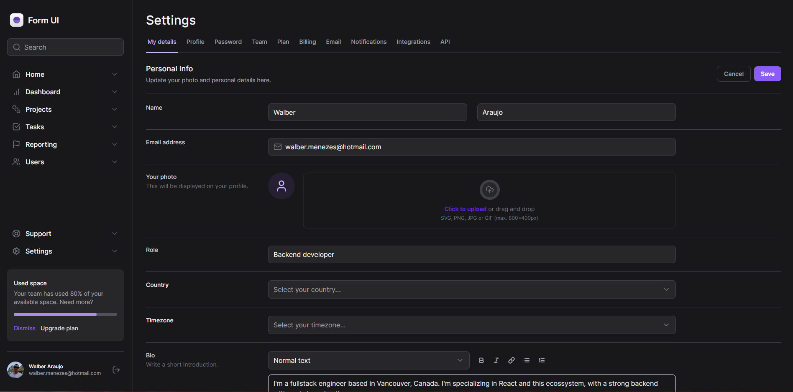
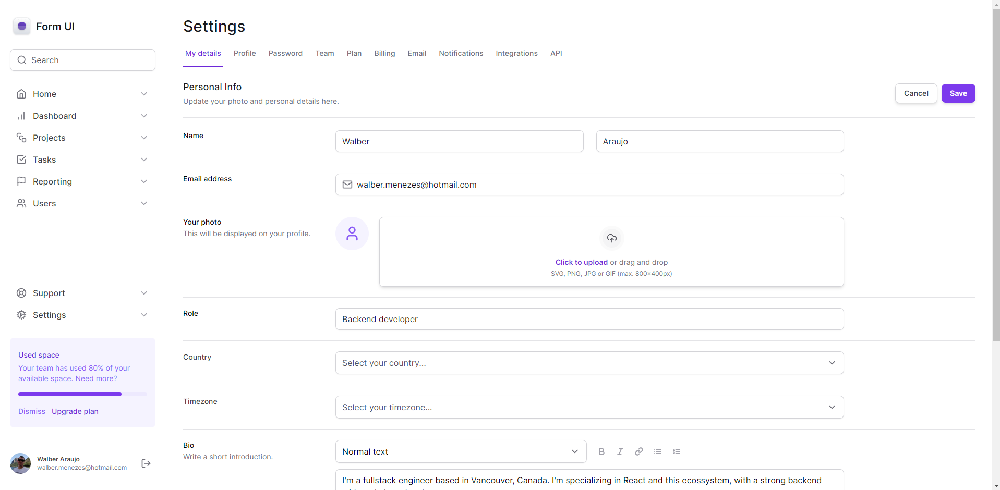

# Tailwind with next JS

---

## Project to practice tailwind in React, building a form with multiples menus and react elements with next JS.

Used this figma to build the project:
[figma](https://www.figma.com/file/MU3H8HfTxX32ukt8ANpan7/Ignite-Tailwind?type=design&node-id=1-11268&mode=design&t=sLyRisVtjkNYzlHf-0)

In this project we can find:

- React Selectors and State
- NextJS
- Radix
- Responsivity
- Dark Mode
- React flags
- Menu collapseble
- Formkit auto animate to dropdowns
- React scroll area to mobile integrations
- Upload to preview Images

Bellow you can check the result of the construction.

---

You can check the result in this [URL](https://walber2903.github.io/tailwind-next/)
